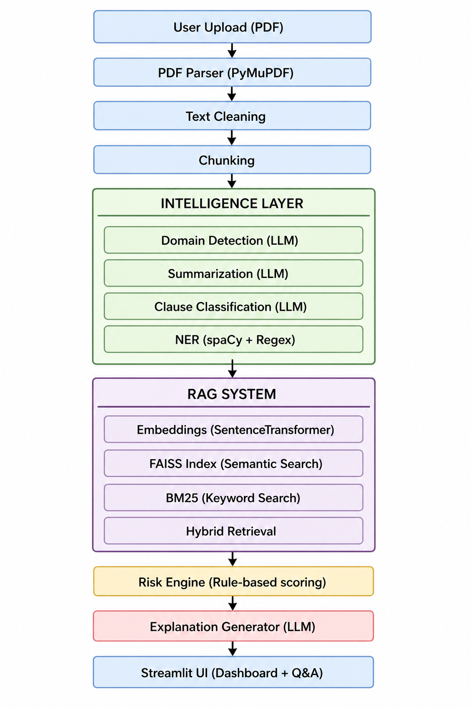
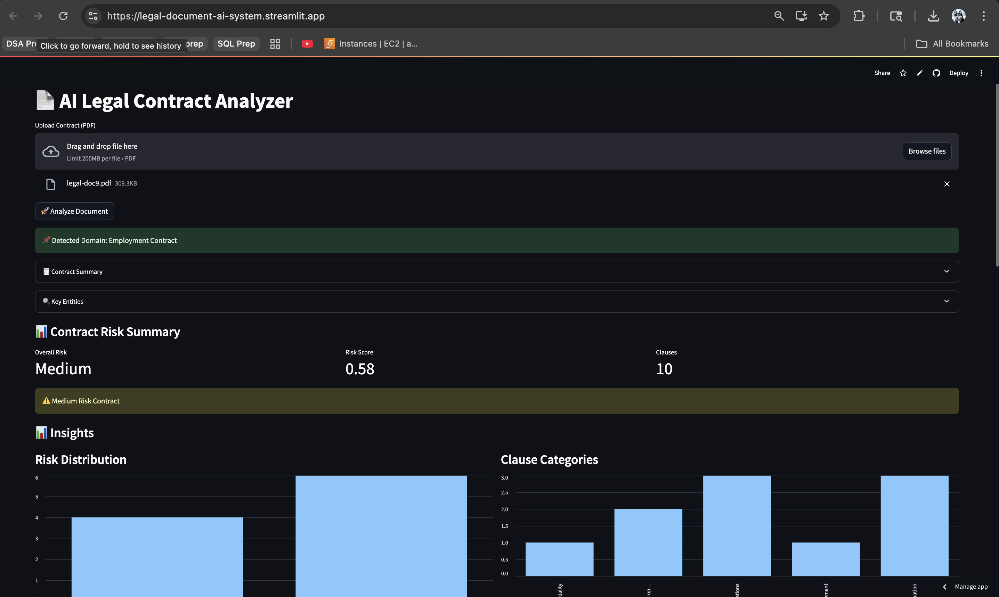

# Legal Document AI Analyzer (RAG + NLP + Risk Scoring)

## 📌 Problem

Legal contracts are complex and time-consuming to analyze. 
This system automates clause classification, risk detection, and question answering using NLP and Retrieval-Augmented Generation (RAG).

## 🚀 Features

- 📄 PDF contract ingestion and parsing
- 🧠 Clause classification using LLM (BERT-based reasoning)
- ⚖️ Risk scoring engine (rule-based + ML signals)
- 🔍 Named Entity Recognition (spaCy + custom cleaning)
- 📚 Hybrid RAG (FAISS + BM25) for question answering
- 📊 Interactive dashboard (Streamlit)

## 🧠 Architecture



## 🧠 Architecture Explanation

1. Document Ingestion → Extract text from PDF
2. Preprocessing → Cleaning + chunking
3. Embedding → Sentence Transformers (MiniLM)
4. Retrieval → FAISS (semantic) + BM25 (keyword)
5. LLM Layer:
   - Clause classification
   - Summarization
   - Risk explanation
6. Risk Engine:
   - Category-based scoring
   - Keyword detection
   - Domain-aware adjustments
7. UI → Streamlit dashboard

## 📊 Demo



## 🧪 Tech Stack

- NLP: spaCy, Sentence Transformers
- LLM: OpenAI (GPT-4o-mini)
- Retrieval: FAISS, BM25
- Backend: Python
- UI: Streamlit
- PDF Parsing: PyMuPDF

## 📊 Sample Output

- Category: Termination  
- Risk Level: High  
- Risk Score: 0.82  

Explanation:
"Immediate termination without cause exposes the employee to high risk."

## ⚙️ Setup

```bash
git clone <repo>
cd project
pip install -r requirements.txt
export OPENAI_API_KEY=your_key
streamlit run ui/app.py

---

# ✅ 8. Key Design Decisions (THIS IS INTERVIEW GOLD)

```md
## 🧠 Key Design Decisions

- Used Hybrid Retrieval (FAISS + BM25) to improve accuracy
- Combined rule-based and LLM signals for robust risk scoring
- Limited chunk size to balance context vs performance
- Avoided fine-tuning due to limited labeled data

## 🔮 Future Work

- Fine-tuned legal domain models
- Multi-agent architecture for complex workflows
- Advanced evaluation metrics
- Real-time document processing pipeline