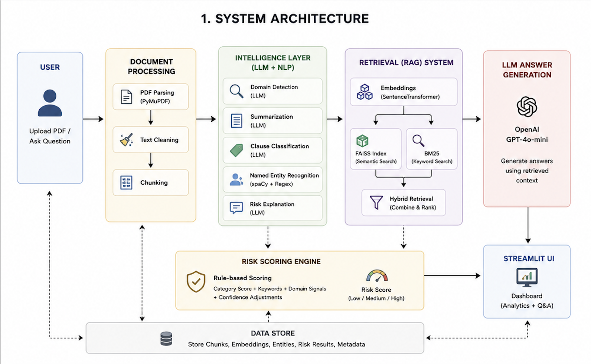
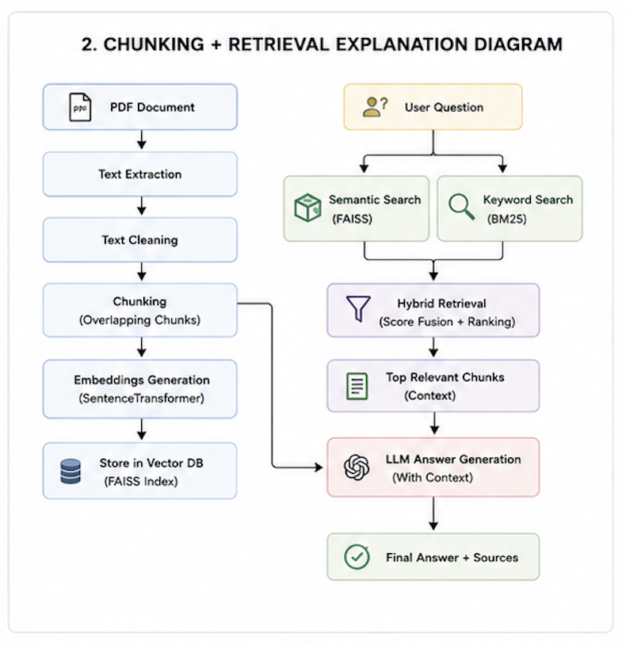
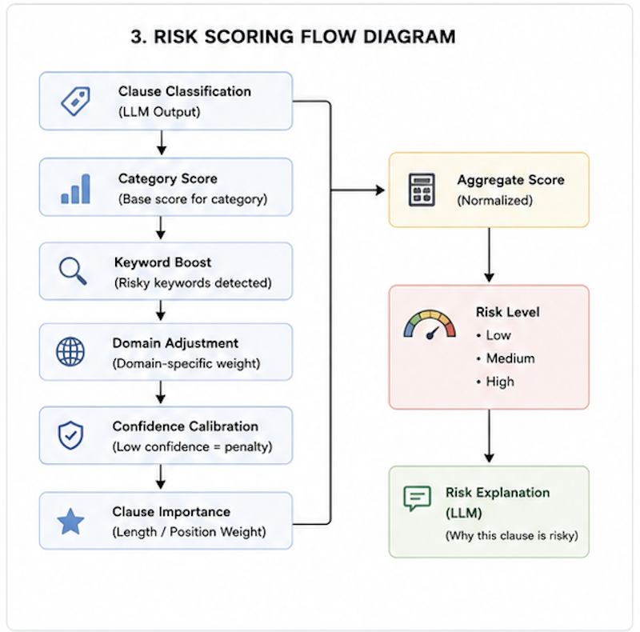
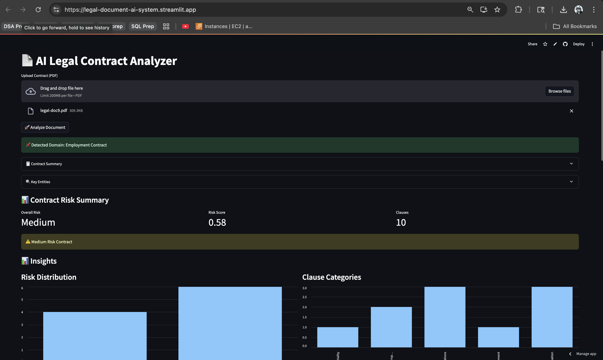
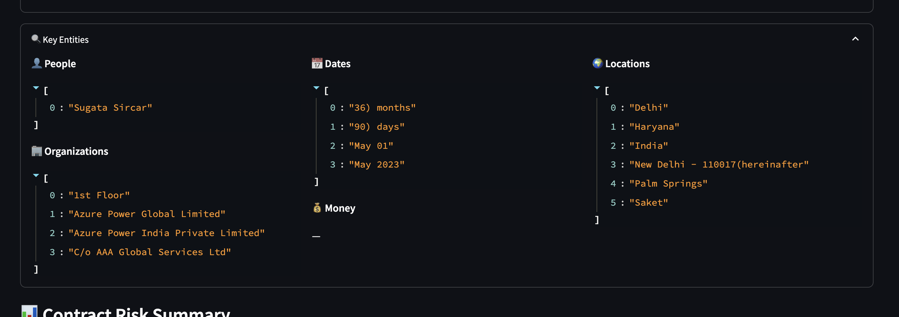
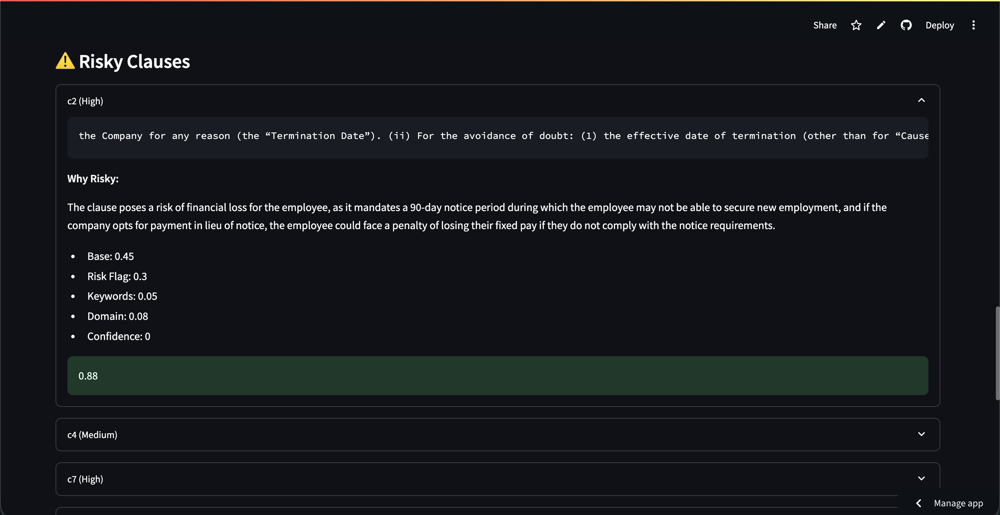
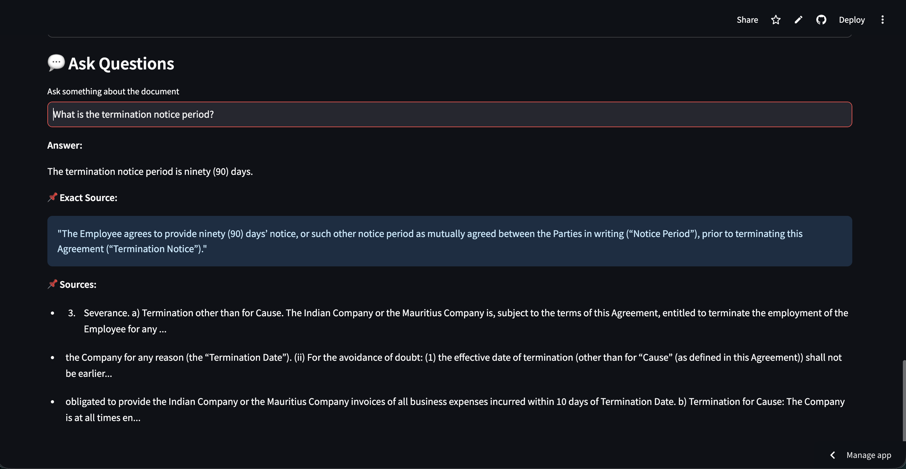

# Legal Document AI Analyzer (RAG + NLP + Risk Scoring)

## 📌 Overview

Legal contracts are lengthy, complex, and difficult to analyze manually.  
This project automates legal document analysis using NLP, Large Language Models (LLMs), and Retrieval-Augmented Generation (RAG).

The system can:

- Extract and clean text from PDF contracts
- Detect contract domain
- Generate summaries
- Classify clauses
- Detect risky clauses
- Extract important entities
- Answer questions using Hybrid RAG retrieval

---

# 🚀 Features

- 📄 PDF contract ingestion and parsing
- 🧠 Clause classification using LLM (zero-shot prompt-based reasoning)
- 📚 Semantic embeddings using SentenceTransformers (MiniLM)
- ⚖️ Rule-based risk scoring engine
- 🔍 Named Entity Recognition (spaCy + Regex + custom cleaning)
- 📚 Hybrid RAG retrieval (FAISS + BM25)
- 💬 Question Answering over contracts
- 📊 Interactive Streamlit dashboard

---

# 🧠 System Architecture



---

# 🧠 Architecture Explanation

## 1. Document Ingestion

- Upload legal contract PDF
- Extract raw text using PyMuPDF

## 2. Preprocessing

- Text cleaning
- Chunk generation for retrieval

## 3. Intelligence Layer

- Domain detection using LLM
- Contract summarization
- Clause classification
- Named Entity Recognition
- Risk explanation generation

## 4. Retrieval Layer (Hybrid RAG)

- Semantic retrieval using FAISS
- Keyword retrieval using BM25
- Hybrid ranking strategy

## 5. Risk Engine

- Category-based scoring
- Keyword-based boosts
- Domain-aware adjustments
- Confidence calibration

## 6. Output Layer

- Risk dashboard
- Clause analytics
- Q&A interface
- Risk explanations

---

# 📚 Chunking + Retrieval Flow



### Flow

PDF → Text Cleaning → Chunking → Embeddings → FAISS + BM25 Retrieval → Hybrid Ranking → LLM Answer Generation

---

# ⚖️ Risk Scoring Flow



### Risk Calculation Logic

The risk engine combines multiple signals:

- Clause category score
- Risk keywords
- Domain adjustments
- Confidence calibration

Final scores are normalized into:

- Low Risk
- Medium Risk
- High Risk

---

# 📊 Demo Screenshots

## Main Dashboard



## Entity Extraction



## Risky Clause Explanation



## Q&A System



---

# 🧪 Tech Stack

## NLP & Retrieval

- spaCy
- SentenceTransformers
- FAISS
- BM25

## LLM

- OpenAI GPT-4o-mini

## Backend

- Python

## Frontend

- Streamlit

## PDF Processing

- PyMuPDF

---

# 📊 Sample Output

### Clause Classification

- Category: Termination
- Risk Level: High
- Risk Score: 0.82

### Explanation

> Immediate termination without cause exposes the employee to high legal and financial risk.

---

# 🧠 Key Design Decisions

- Used Hybrid Retrieval (FAISS + BM25) to improve retrieval accuracy
- Combined LLM reasoning with rule-based scoring
- Used chunk-based retrieval for scalable document processing
- Avoided fine-tuning due to limited labeled legal datasets
- Added custom entity cleaning to reduce noisy NER outputs

---

# ⚙️ Setup

## Clone Repository

```bash
git clone https://github.com/Dhanush-kumar-reddy/legal-document-ai-system
cd legal-document-ai-system
```

## Install Dependencies

```bash
pip install -r requirements.txt
```

## Add OpenAI API Key

```bash
export OPENAI_API_KEY=your_api_key
```

## Run Application

```bash
streamlit run ui/app.py
```

---

# 📂 Project Structure

```bash
legal-document-ai-system/
│
├── src/
│   ├── ingestion/
│   ├── processing/
│   ├── rag/
│   ├── risk/
│   ├── llm/
│   ├── ner/
│   └── evaluation/
│
├── ui/
│
├── assets/
│
├── data/
│
├── requirements.txt
│
└── README.md
```

---

# 🔮 Future Improvements

- Citation highlighting for retrieved clauses
- Conversation memory for Q&A
- Larger evaluation datasets
- Advanced legal-domain evaluation
- Real-time processing pipeline

---

# 📌 Deployment

The application is deployed using Streamlit Cloud.

---

# 📜 License

This project is for educational and research purposes.